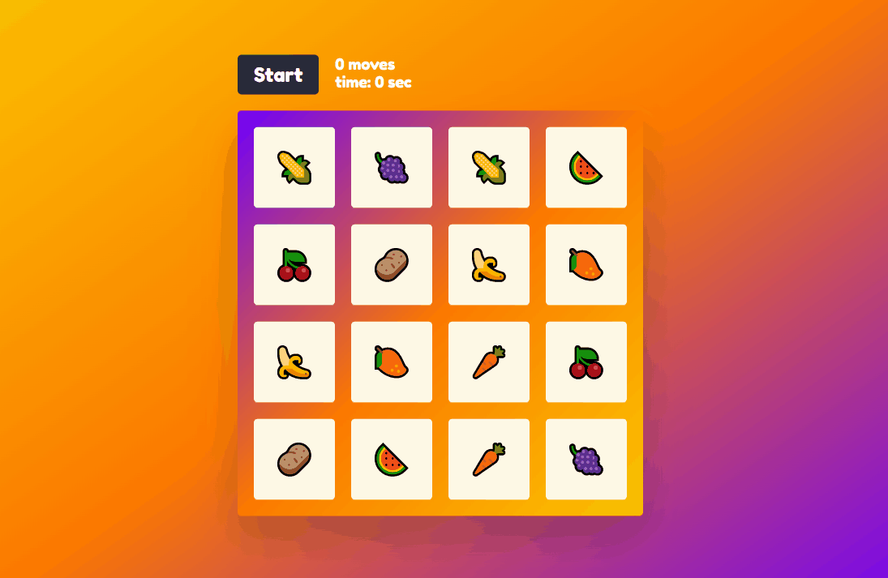

# 🧠 NEURAL MATCH GRID GAME 

A simple and elegant card matching game built to challenge and train your memory. Flip cards, find matching pairs, and try to complete the grid in as few moves as possible!

 <!-- Optional: Add a demo gif or screenshot -->

## 🚀 Features

- Flip-and-match card mechanics
- Dynamic shuffling of cards on every game start
- Move counter and timer (optional)
- Responsive layout for desktop and mobile
- Simple, modular codebase

## 🛠️ Tech Stack

- **HTML5** / **CSS3**
- **JavaScript (Vanilla)** or _(React / Vue / Svelte / etc. if applicable)_
- Optional: Add libraries like `Tailwind`, `React`, `TypeScript`, etc.

## 🧩 Gameplay

1. Click on two cards to flip them.
2. If the cards match, they remain face up.
3. If not, they flip back after a short delay.
4. The game ends when all pairs are matched.

## 📦 Installation

Clone the repo and open the game in your browser:

    ```bash
      git clone https://github.com/yourusername/memory-match-game.git
      cd memory-match-game
      open index.html


## <b> [Click here to Play the GAME!!](https://vectorstatic.github.io/Memory-Matching-Game/)


This project is made using HTML,CSS &amp; JavaScript.

It's a simple online memory matching game, which contains various levels.
<br>
Here are some snapshots from game.


<br><br>
